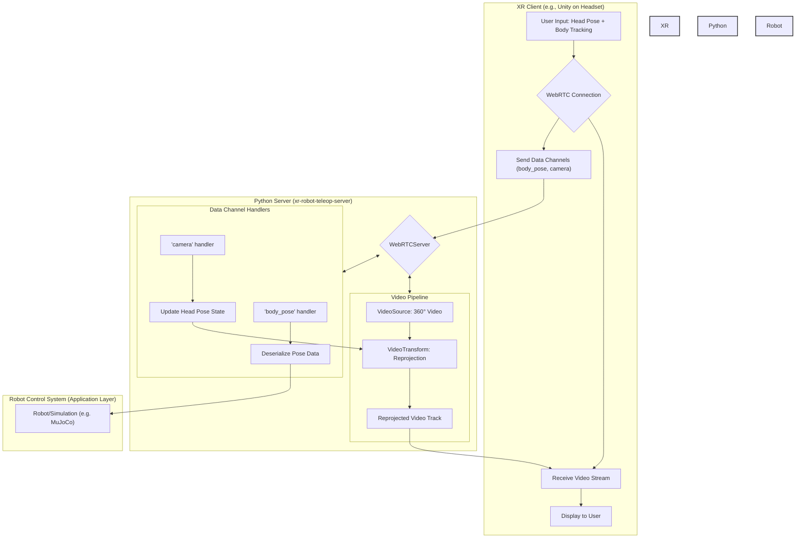
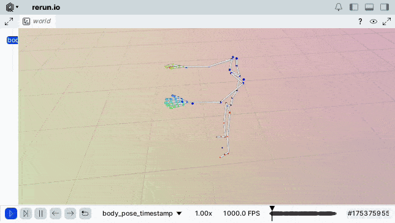

# XR Robot Teleop Server

[](https://badge.fury.io/py/xr-robot-teleop-server)
[](https://github.com/yunho-c/xr-robot-teleop-server/actions/workflows/python-package.yml)

A high-performance Python server designed to stream 360° panoramic video and full-body tracking data to XR headsets (like Quest 3, Vision Pro) for immersive robot teleoperation. It uses WebRTC for low-latency communication and features a modular architecture for easy customization.

## Key Features

-   **Low-Latency Streaming**: Built on `aiortc` and `FastAPI` for efficient WebRTC communication.
-   **360° Video Reprojection**: Dynamically transforms 360° equirectangular video into a perspective view based on the user's head orientation, providing an immersive FPV experience.
-   **Full Body Tracking**: Receives, deserializes, and processes full-body, upper-body, and hand skeleton data from XR clients (e.g., a Unity app).
-   **Modular & Extensible**: Easily replace video sources (e.g., from a file, a live camera, or a GoPro stream) and video transformations with your own custom classes.
-   **Hardware Acceleration**: Utilizes FFmpeg's hardware acceleration capabilities (`videotoolbox`, `d3d11va`, `vaapi`, etc.) for efficient video decoding, minimizing CPU load.
-   **Coordinate System Handling**: Includes utilities to convert coordinate systems between different platforms (e.g., Unity's left-handed Y-up to a standard right-handed Z-up).
-   **Rich Data Schemas**: Provides clear Python enumerations for OpenXR and OVR skeleton bone IDs, simplifying data interpretation.
-   **Integrated Visualization**: Comes with an example to visualize the received body pose data in 3D using the [Rerun](https://www.rerun.io/) SDK.

## System Architecture

The server acts as a bridge between an XR client (e.g., a VR headset running a Unity application) and a robot control system. The client sends head pose and body tracking data to the server, which in turn processes it and sends back a reprojected video stream. The processed body pose can then be used to command a robot or a simulation.



## Getting Started

### Installation

```bash
pip install xr-robot-teleop-server
```

### Development

1.  **Clone the repository:**
    ```bash
    git clone https://github.com/your-username/xr-robot-teleop-server.git
    cd xr-robot-teleop-server
    ```

2.  **Install the package:**
    For basic usage, install the package in editable mode:
    ```bash
    pip install -e .
    ```
    To include dependencies for the visualization example (`rerun`), install with the `[viz]` extra:
    ```bash
    pip install -e ".[viz]"
    ```

### Running the Examples

This project includes examples to demonstrate its capabilities.

#### Record and Visualize Full Body Pose

This example starts a WebRTC server that listens for full-body tracking data from a client, deserializes it, and visualizes the skeleton in 3D using Rerun.

1.  **Run the server:**
    ```bash
    python examples/record_full_body_pose.py --visualize
    ```
    The server will start and print: `INFO      Starting xr-robot-teleop-server...`

2.  **Connect your client:**
    Connect your XR client to the server at `http://<your-server-ip>:8080`. Once the WebRTC connection is established, the server will start receiving data.

3.  **Visualize:**
    A Rerun viewer window will spawn, displaying the received skeleton poses in real-time.

    

## Usage

The core of the server is the `WebRTCServer` class. You can instantiate it with factories for creating video tracks and handlers for data channels.

```python
from xr_robot_teleop_server.streaming import WebRTCServer
from xr_robot_teleop_server.sources import FFmpegFileSource
from xr_robot_teleop_server.transforms import EquilibEqui2Pers
from aiortc import MediaStreamTrack
import numpy as np

# 1. Define a shared state object (optional)
# This object is shared between the video track and data channel handlers
# for a single peer connection.
class AppState:
    def __init__(self):
        self.pitch = 0.0
        self.yaw = 0.0
        self.roll = 0.0

# 2. Define a handler for an incoming data channel
def on_camera_message(message: str, state: AppState):
    # Parse message and update the shared state
    data = json.loads(message)
    state.pitch = np.deg2rad(float(data.get("pitch", 0.0)))
    state.yaw = np.deg2rad(float(data.get("yaw", 0.0)))

# 3. Define a factory for the video track
# This factory creates the video source, the transform, and the track itself.
class ReprojectionTrack(MediaStreamTrack):
    kind = "video"

    def __init__(self, state: AppState):
        super().__init__()
        self.state = state
        self.source = FFmpegFileSource("path/to/your/360_video.mp4")
        self.transform = EquilibEqui2Pers(output_width=1280, output_height=720, fov_x=90.0)

    async def recv(self):
        equi_frame_rgb = next(self.source)
        rot = {"pitch": self.state.pitch, "yaw": self.state.yaw, "roll": self.state.roll}
        perspective_frame = self.transform.transform(frame=equi_frame_rgb, rot=rot)
        # ... create and return av.VideoFrame ...

# 4. Configure and run the server
if __name__ == "__main__":
    data_handlers = {
        "camera": on_camera_message,
        # Add other handlers for "body_pose", "left_hand", etc.
    }

    server = WebRTCServer(
        state_factory=AppState,
        video_track_factory=ReprojectionTrack,
        datachannel_handlers=data_handlers,
    )

    server.run()
```

## Project Structure

```
.
├── examples/                 # Example scripts showing how to use the server
├── src/
│   └── xr_robot_teleop_server/
│       ├── schemas/          # Data schemas for skeletons (OpenXR) and poses
│       ├── sources/          # Pluggable video sources (FFmpeg, OpenCV)
│       ├── streaming/        # Core WebRTC server logic
│       └── transforms/       # Pluggable video transformations (e.g., reprojection)
├── tests/                    # Unit and integration tests
└── pyproject.toml            # Project metadata and dependencies
```

## Dependencies

-   **Core**: `aiortc`, `fastapi`, `uvicorn`, `numpy`, `loguru`
-   **Transforms**: `equilib`
-   **Video Sources**: `opencv-python` (optional), `ffmpeg` (must be in system PATH for `FFmpegFileSource`)
-   **Visualization**: `rerun-sdk`

See `pyproject.toml` for detailed dependency information.

## License

This project is licensed under the terms of the [LICENSE](LICENSE) file.
